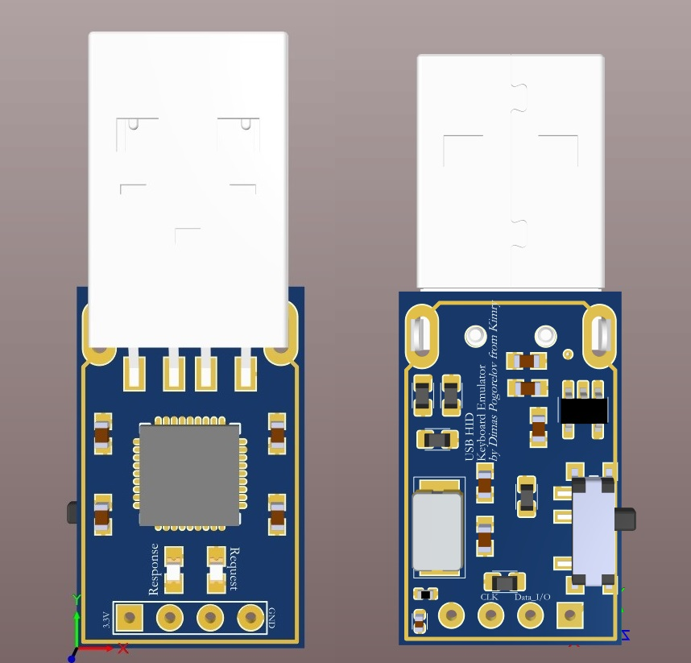
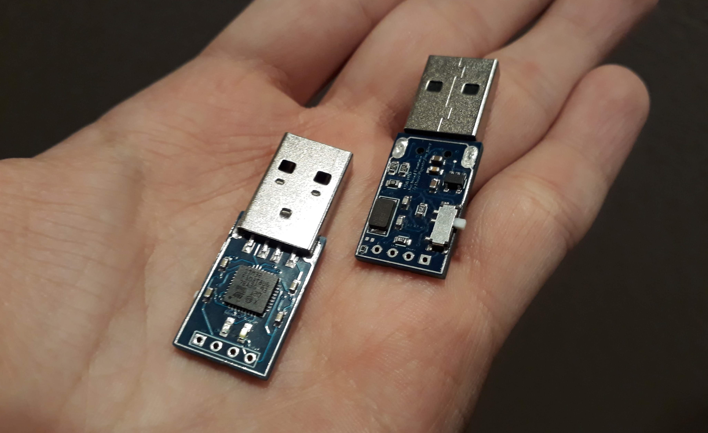

# KeyboardEmulator
Управляемый эмулятор клавиатуры на микроконтроллере STM32F103(Cortex-M3).

Запуск команд происходит по отсылке запроса libusb_bulk_transfer(dev_handle, 0x01, data, 64, NULL, 1000); 0x01 - конечная точка приема, data - просто массив 64 байт на третьем месте которого что угодно, но не ноль.

После создания проекта для своего микроконтроллера в Stm32CubeMx вы можете скопировать эти файлы с заменой, точно подойдет для stm32f103c8t6. 
Чтобы установить свои нажатия выберите скан код клавиши и подставьте в pressButton(код клавиши, таймаут до след нажатия).
Если хотите сделать просто кликер без управления по usb, то можете просто убрать if(usb_recive_buf[2] != 0x00) в главном цикле и тогда как только вы подключите устройство, то команды начнут исполняться.

Скан коды:

0x04 - a | 0x05 - b | 0x06 - c | 0x07 - d | 0x08 - e | 0x09 - f | 0x0A - g | 0x0B - h | 0x0C	- i |0x0D - j | 0x0E - k | 0x0F - l | 0x10 - m | 0x11 - n | 0x12 - o | 0x13 - p | 0x14	- q | 0x15 - r | 0x16 - s | 0x17 - t | 0x18 - u | 0x19 - v | 0x1A - w | 0x1B - x | 0x1C - y | 0x1D - z | 0x1E - 1 and ! | 0x1F - 2 and @ | 0x20 - 3 and # | 0x21 - 4 and $ | 0x22 - 5 and % | 0x23 - 6 and ^ | 0x24 - 7 and & | 0x25 - 8 and * | 0x26 - 9 and ( | 0x27 | - 0 and ) | 0xE0 - Ctrl | 0xE1 - LeftShift | 0xE2 - LeftAlt | 0x28 - Return (ENTER) | 0x29 - ESCAPE | 0x2A - DELETE (Backspace) | 0x2B - Tab | 0x2C - Spacebar | 0x39 - Caps Lock | 0x3A - F1 | 0x3B - F2 | 0x3C - F3 | 0x3D - F4 | 0x3E - F5 | 0x3F - F6 | 0x40 - F7 | 0x41 - F8 | 0x42 - F9 | 0x43 - F10 | 0x44 - F11 | 0x45 - F12 | 0x46 - PrintScreen | 0x47 - Scroll Lock | 0x48 - Pause | 0x49 - Insert | 0x4A - Home | 0x4B - PageUp | 0x4C - Delete Forward | 0x4D - End | 0x4E - PageDown | 0x4F - RightArrow | 0x50 - LeftArrow | 0x51 - DownArrow | 0x52 - UpArrow | 0x7B - Cut | 0x7C - Copy | 0x7D - Paste | 0x7E - Find | 0x7F - Mute | 0x80 - Volume Up | 0x81 - Volume Down

Как это все работает: https://youtu.be/uVVuiN60hYE
Видос с подключением эмулятора к ПК: https://www.youtube.com/watch?v=c9gwrJI-5ao

Так выглядит эмулятор:

Изготовленное устройство:

